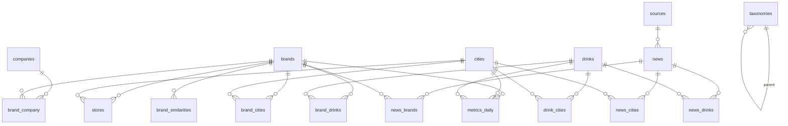

# Global Boba Graph 資料模型規格 v1.3

> **更新紀錄**
> - **v1.3 (2026-05-30)**：對齊 Phase 5 實作 — 新增 §14 search_log、§15 圖片儲存（Vercel Blob），更新 §7 metrics_daily metric enum 完整列表、§1.4 news 補 `ai_summary_reviewed_at` 欄位、§5 sources status 預設改 `PUBLISHED`。
> - **v1.2 (2026-05-28)**：完成 Phase 5A 關聯編輯，Brand/News 編輯後台支援 brand_drinks/brand_cities/brand_company/news_brands/news_cities/news_drinks 全套關聯維護。
> - **v1**：初版 schema 規格。

本檔補齊 `prototype-spec.md` 中未明確定義的實體、屬性、關聯與衍生指標計算。所有 schema 假設使用 PostgreSQL（或同等關聯式資料庫）；欄位命名採 `snake_case`，主鍵採 UUID v7（時序可排序）。

實作上 Postgres / Supabase 採 `gen_random_uuid()`（UUID v4），效能與排序需求都能滿足；遷移到 UUID v7 是後續優化方向（不需動 schema）。

---

## 0. 命名與型別約定

- `id`：UUID v7。
- `slug`：URL-safe，唯一鍵，限定 `[a-z0-9-]`，長度 ≤ 80。
- `created_at` / `updated_at`：`timestamptz`，預設 `now()`；所有實體皆有。
- `status`：enum `draft | published | archived`，所有可公開實體皆有。
- 任何顯示給使用者的長文字（name、description、summary）走 i18n 結構（見 §6）。
- 數量、價格、分數一律存原始值並另存幣別 / 單位欄位，不在欄位名稱中編碼單位。

---

## 1. 核心實體（Core Entities）

### 1.1 brands

| 欄位 | 型別 | 必填 | 說明 |
|---|---|---|---|
| `id` | uuid | ✓ | PK |
| `slug` | text | ✓ | 唯一，例 `gong-cha` |
| `name_i18n` | jsonb | ✓ | `{zh-TW, zh-CN, en, ja}`，見 §6 |
| `country_code` | char(2) | ✓ | ISO 3166-1 alpha-2 |
| `founded_year` | smallint | | |
| `headquarters_city_id` | uuid → cities | | |
| `store_count` | integer | | 最新總店數（衍生自 stores 但快取） |
| `business_model` | enum | ✓ | `direct | franchise | hybrid | licensed` |
| `price_tier` | enum | ✓ | `value | mid | premium | luxury` |
| `positioning_tags` | text[] | | 例 `["fruit-tea", "tea-focused", "instagrammable"]` |
| `official_website` | text | | |
| `social_handles` | jsonb | | `{instagram, tiktok, x, youtube, weibo, xiaohongshu}` |
| `logo_url` | text | | |
| `hero_image_url` | text | | |
| `description_i18n` | jsonb | | 長介紹 |
| `seo_i18n` | jsonb | | `{[locale]: {title, description, faq[]}}` |
| `claimed_by_user_id` | uuid → users | | 品牌認領機制（v2 上線） |
| `verified` | boolean | | 預設 false |
| `status` | enum | ✓ | |
| `created_at` / `updated_at` | timestamptz | ✓ | |

**刪除策略**：軟刪除（`status = archived`），不真刪，否則 SEO 連結會 404。

### 1.2 cities

| 欄位 | 型別 | 必填 | 說明 |
|---|---|---|---|
| `id` | uuid | ✓ | |
| `slug` | text | ✓ | 例 `tokyo`、`taipei` |
| `name_i18n` | jsonb | ✓ | |
| `country_code` | char(2) | ✓ | |
| `admin_region` | text | | 都/道/府/縣/省/州，i18n |
| `lat` | numeric(9,6) | ✓ | |
| `lng` | numeric(9,6) | ✓ | |
| `timezone` | text | ✓ | IANA tz，如 `Asia/Tokyo` |
| `population` | integer | | |
| `avg_price_local` | numeric(10,2) | | 本地幣別平均一杯價 |
| `avg_price_currency` | char(3) | | ISO 4217 |
| `market_maturity` | enum | | `emerging | growing | mature | saturated`（計算見 §7） |
| `description_i18n` | jsonb | | |
| `seo_i18n` | jsonb | | |
| `status` | enum | ✓ | |

### 1.3 drinks

| 欄位 | 型別 | 必填 | 說明 |
|---|---|---|---|
| `id` | uuid | ✓ | |
| `slug` | text | ✓ | 例 `brown-sugar-milk-tea` |
| `name_i18n` | jsonb | ✓ | |
| `category` | enum | ✓ | `milk-tea | fruit-tea | pure-tea | cheese-tea | coffee-tea | smoothie | other` |
| `tea_base` | enum[] | | 見 §4 受控詞彙 |
| `milk_type` | enum | | 見 §4 |
| `toppings` | enum[] | | 見 §4 |
| `sweetener` | enum | | 見 §4 |
| `temperature` | enum[] | | `hot | iced | blended` |
| `typical_sugar_levels` | enum[] | | `0 | 30 | 50 | 70 | 100` |
| `calories_kcal_min` | smallint | | 範圍下界（中杯標準） |
| `calories_kcal_max` | smallint | | 範圍上界 |
| `caffeine_mg_min` | smallint | | |
| `caffeine_mg_max` | smallint | | |
| `flavor_profile` | jsonb | | `{sweet:0-5, bitter:0-5, milky:0-5, fruity:0-5, floral:0-5, roasted:0-5}` |
| `description_i18n` | jsonb | | |
| `seo_i18n` | jsonb | | |
| `status` | enum | ✓ | |

**為什麼用數值範圍**：不同品牌同一款飲品熱量不同；存區間並另在 `brand_drinks` 上記特定品牌的精確值。

### 1.4 news

| 欄位 | 型別 | 必填 | 說明 |
|---|---|---|---|
| `id` | uuid | ✓ | |
| `slug` | text | ✓ | |
| `title_i18n` | jsonb | ✓ | |
| `summary_i18n` | jsonb | ✓ | 編輯撰寫的人類摘要 |
| `body_i18n` | jsonb | ✓ | markdown |
| `ai_summary_i18n` | jsonb | | AI 草稿，內部標註 `reviewed_by` 後才可公開 |
| `ai_summary_reviewed_by` | uuid → users | | NULL 表示未審 → 前台不顯示 |
| `ai_summary_reviewed_at` | timestamptz | | 審核時間；與 `reviewed_by` 一起判斷可發布 |
| `category` | enum | ✓ | `expansion | launch | franchise-investment | city-market | trend | supply-chain | culture` |
| `source_id` | uuid → sources | ✓ | 主要來源 |
| `source_url` | text | ✓ | 原文 URL |
| `published_at` | timestamptz | ✓ | 原始發布時間 |
| `hero_image_url` | text | | |
| `editor_tags` | text[] | | 自由標籤 |
| `seo_i18n` | jsonb | | |
| `status` | enum | ✓ | |

---

## 2. 新增實體：stores（店鋪）

支援「城市推薦店鋪」「全球地圖」「LocalBusiness JSON-LD」「加盟商情報」。

| 欄位 | 型別 | 必填 | 說明 |
|---|---|---|---|
| `id` | uuid | ✓ | |
| `brand_id` | uuid → brands | ✓ | |
| `city_id` | uuid → cities | ✓ | |
| `name_i18n` | jsonb | | 多數店鋪用品牌名 + 分店名 |
| `address_i18n` | jsonb | ✓ | 地址需要多語 |
| `lat` | numeric(9,6) | ✓ | |
| `lng` | numeric(9,6) | ✓ | |
| `phone` | text | | E.164 格式 |
| `opening_hours` | jsonb | | schema.org OpeningHoursSpecification 結構 |
| `is_flagship` | boolean | | 旗艦店 |
| `opened_at` | date | | 開幕日（重要 — 計算城市市場成熟度用） |
| `closed_at` | date | | 結束營業日；NULL = 仍營業 |
| `franchise` | boolean | | 是否加盟店 |
| `external_ids` | jsonb | | `{google_place_id, yelp_id, naver_id, ...}` 防重要 |
| `status` | enum | ✓ | |

**索引**：
- `(brand_id, city_id)` — 城市頁查 brand 在當地店數。
- `GIST(point(lng, lat))` — 地圖框選與「我附近」查詢。
- `(city_id, opened_at)` — 計算城市新增店速度。

---

## 3. 新增實體：companies（母公司 / 集團）

| 欄位 | 型別 | 必填 | 說明 |
|---|---|---|---|
| `id` | uuid | ✓ | |
| `slug` | text | ✓ | 例 `la-kaffa-international` |
| `name_i18n` | jsonb | ✓ | |
| `country_code` | char(2) | ✓ | |
| `founded_year` | smallint | | |
| `stock_ticker` | text | | 例 `TWSE:2729` |
| `website` | text | | |
| `description_i18n` | jsonb | | |
| `status` | enum | ✓ | |

### 3.1 brand_company（多對多 + 關係類型）

| 欄位 | 型別 | 必填 | 說明 |
|---|---|---|---|
| `brand_id` | uuid | ✓ | |
| `company_id` | uuid | ✓ | |
| `relation` | enum | ✓ | `owner | parent | licensor | franchisor | investor | former-owner` |
| `since` | date | | |
| `until` | date | | NULL = 仍生效 |
| `notes` | text | | |
| PK | `(brand_id, company_id, relation, since)` | | 允許時序變更（被收購歷史） |

---

## 4. 飲品受控詞彙（taxonomy）

統一存於 `taxonomies` 表，避免散落 enum 在多處：

```
taxonomies(id, kind, code, label_i18n, parent_id, sort_order, status)
```

`kind` 包含：

| kind | 範例 code |
|---|---|
| `tea_base` | `green`, `black`, `oolong`, `pu-erh`, `matcha`, `roasted-oolong`, `jasmine`, `earl-grey` |
| `milk_type` | `dairy`, `non-dairy-cream`, `oat`, `almond`, `soy`, `coconut`, `condensed`, `none` |
| `topping` | `tapioca-pearl`, `mini-pearl`, `crystal-boba`, `pudding`, `grass-jelly`, `aloe`, `cheese-foam`, `salted-cream`, `red-bean`, `coconut-jelly`, `popping-boba`, `taro-paste` |
| `sweetener` | `cane-sugar`, `brown-sugar`, `honey`, `fructose`, `stevia`, `none` |
| `flavor_tag` | `sweet`, `bitter`, `milky`, `fruity`, `floral`, `roasted`, `creamy`, `refreshing` |
| `positioning_tag` | `fruit-tea`, `tea-focused`, `instagrammable`, `value`, `premium`, `health-oriented` |

**好處**：
- 新增詞彙不需 schema migration。
- 詞彙本身可 i18n、可有層級（`parent_id`，例 `oolong` 下放 `roasted-oolong`、`high-mountain`）。
- 飲品的 `tea_base[]`、`toppings[]` 等欄位存 taxonomy `code` 陣列即可。

---

## 5. 新增實體：sources（新聞來源）

| 欄位 | 型別 | 必填 | 說明 |
|---|---|---|---|
| `id` | uuid | ✓ | |
| `slug` | text | ✓ | 例 `nikkei`、`food-navigator-asia` |
| `name_i18n` | jsonb | ✓ | |
| `domain` | text | ✓ | 例 `nikkei.com` |
| `country_code` | char(2) | | |
| `primary_language` | text | ✓ | BCP-47，例 `ja`、`zh-TW` |
| `kind` | enum | ✓ | `mainstream-media | trade-press | corporate-pr | blog | social | aggregator` |
| `credibility_score` | smallint | | 0-100，編輯部評定 |
| `paywall` | boolean | | |
| `notes` | text | | |
| `status` | enum | ✓ | 預設 `published`（sources 屬於 reference data，不走草稿審稿） |

**索引**：`UNIQUE(domain)` — 同一域名只能一個 source，方便去重。

---

## 6. i18n 翻譯結構

### 6.1 選型：inline JSONB 而非 translations 表

對於 MVP（4 種 locale、≤ 1000 個實體），**採 inline JSONB**：

```jsonc
"name_i18n": {
  "zh-TW": "貢茶",
  "zh-CN": "贡茶",
  "en": "Gong Cha",
  "ja": "ゴンチャ"
}
```

- **優點**：查詢單一實體就拿到所有語言，無 JOIN；遷移簡單。
- **缺點**：每實體每欄位儲存膨脹；當 locale 數 > 8 或翻譯量 > 10 萬條時，遷移到 `entity_translations(entity_kind, entity_id, locale, field, value)`。

### 6.2 locale 清單（MVP）

- `zh-TW`（主）
- `zh-CN`
- `en`
- `ja`

新增 locale 不需 schema 改動，只需 `i18n_config` 表登記。

### 6.3 fallback 策略

讀取順序：請求 locale → `zh-TW`（預設）→ `en` → 任一非空。前端 SSG 時要把 fallback 結果固化到 HTML，不能 client-side 才決定（會造成 hydration mismatch）。

### 6.4 SEO 多語欄位

`seo_i18n` 結構：

```jsonc
{
  "zh-TW": {
    "title": "...",
    "description": "...",
    "canonical": "https://.../zh-tw/brands/gong-cha",
    "faq": [{"q": "...", "a": "..."}]
  },
  "en": { ... }
}
```

`hreflang` tag 從這個 jsonb 的 keys 自動產生，避免漏配。

---

## 7. metrics（衍生指標歷史）

`trending_score`、`market_maturity` 不直接寫回實體欄位，改存歷史表，原實體欄位只快取最新值（或乾脆查 view）。

### 7.1 metrics_daily

| 欄位 | 型別 | 必填 | 說明 |
|---|---|---|---|
| `entity_kind` | enum | ✓ | `brand | city | drink` |
| `entity_id` | uuid | ✓ | polymorphic — 故意不設 FK |
| `metric` | enum | ✓ | 見下方完整列表 |
| `date` | date | ✓ | |
| `value` | numeric(10,4) | ✓ | |
| `inputs` | jsonb | | 計算當下的輸入快照（可重算） |
| `created_at` | timestamptz | ✓ | |
| PK | `(entity_kind, entity_id, metric, date)` | | 每天每實體每指標一筆 |

**metric enum 完整列表**（v1.3 對齊）：

| metric code | 適用 entity_kind | 說明 |
|---|---|---|
| `trending_score` | brand / city / drink | 0-100，綜合熱度分數（見 §7.2） |
| `market_maturity` | city | 分桶 emerging / growing / mature / saturated |
| `popularity_score` | drink / city | 0-100，飲品 × 城市的流行度 |
| `news_count_30d` | brand / city / drink | 近 30 天新聞提及數 |
| `new_store_count_30d` | brand / city | 近 30 天新開店數 |
| `new_store_count_90d` | brand / city | 近 90 天新開店數 |
| `social_mention_30d` | brand | 近 30 天社群提及數（v2 接入 social listening API） |
| `search_volume_30d` | brand / drink | 近 30 天 SearchLog 命中數（見 §14） |
| `active_store_count` | brand / city | 當下營業中店數（`stores.closed_at IS NULL`） |
| `distinct_brand_count` | city | 城市內不同品牌數 |

**索引**：
- `(metric, date, value DESC)` — 排行榜（某 metric 在某天的前 N 名）
- `(entity_kind, entity_id, metric, date DESC)` — 時間軸（某實體某 metric 的歷史走勢）
- `(date)` — 全表 housekeeping

### 7.2 計算公式（v1，每日 cron）

**trending_score**（0-100，套用在 brand / city / drink）：

```
raw = 0.45 * z(news_count_30d)
    + 0.25 * z(new_store_count_90d)        // brand/city only
    + 0.20 * z(social_mention_30d)
    + 0.10 * z(search_volume_30d)          // 若無資料則重分配權重
delta_factor = clamp((value_30d - value_prev_30d) / value_prev_30d, -1, 1)
score = sigmoid(raw + 0.3 * delta_factor) * 100
```

說明：
- `z(x)` = (x − μ) / σ，跨同 kind 的全集計算。
- 缺一項輸入則按比例重分配剩餘權重。
- 套 sigmoid 把無界 z-score 壓到 0-100。
- delta_factor 給「上升中」的實體加分。

**market_maturity**（cities，分桶）：

```
input = log(active_store_count) * 0.5
      + log(distinct_brand_count) * 0.3
      + z(new_store_count_24m) * 0.2
buckets:
  input <  P25  → emerging
  P25 ≤ input < P50 → growing
  P50 ≤ input < P85 → mature
  input ≥ P85       → saturated
```

百分位以「所有已上線城市」為基準計算，每月 rebalance。

### 7.3 為什麼分離

- 可重算：跑分公式調整不必回填欄位，重跑 cron 即可。
- 可解釋：前台可顯示「上週 trending_score 72 → 本週 81，因 7 日內新聞 +6 篇」。
- 可審計：投資方/品牌方質疑分數時，`inputs` 欄位給得出原始輸入。

---

## 8. 關聯表（更新版）

原 spec 列了 `brand_drinks`、`brand_cities`、`news_brands`、`news_cities`、`news_drinks`、`drink_cities`。補強如下：

### 8.1 brand_drinks（強化）

| 欄位 | 說明 |
|---|---|
| `brand_id`, `drink_id` | PK 一部分 |
| `is_signature` | 是否招牌 |
| `local_name_i18n` | 該品牌對此飲品的命名（例 Gong Cha 的「黑糖珍奶」可能叫不同名字） |
| `price_local`, `price_currency` | 該品牌定價（取主市場） |
| `calories_kcal`, `caffeine_mg` | 該品牌精確值（覆蓋 drink 表的區間） |
| `available_markets` | text[]，country_code |
| `since`, `until` | 上下市時間 |

### 8.2 brand_cities

| 欄位 | 說明 |
|---|---|
| `brand_id`, `city_id` | PK |
| `entered_at` | 首次進入該城市 |
| `store_count_cached` | 該城市目前店數（由 stores aggregate） |
| `status` | `active | exited | rumored` |

### 8.3 news_brands / news_cities / news_drinks

| 欄位 | 說明 |
|---|---|
| `news_id` + 對應實體 id | PK |
| `relevance` | enum `primary | secondary | mentioned` — 主角 vs 被提及 |
| `auto_tagged` | boolean — AI 抽取還是人工標 |
| `confirmed_by_user_id` | 人工確認者；AI 標但未確認 = `auto_tagged && NULL` |

### 8.4 drink_cities

| 欄位 | 說明 |
|---|---|
| `drink_id`, `city_id` | PK |
| `popularity_score` | 由 brand_drinks × stores × metrics 計算 |
| `seasonality` | jsonb，月份 → 0-1 熱度 |

### 8.5 brand_similarities（用於「相似品牌」）

| 欄位 | 說明 |
|---|---|
| `brand_a_id`, `brand_b_id` | PK；強制 a < b 避免重複 |
| `score` | 0-1 |
| `factors` | jsonb，例 `{same_price_tier:1, shared_drinks:0.6, shared_cities:0.4}` |
| `updated_at` | |

由 nightly job 計算。

---

## 9. 編輯與品質欄位（橫向加在每個內容實體）

| 欄位 | 用途 |
|---|---|
| `completeness_score` | 0-100，由必填欄位填充率自動算 |
| `last_human_edit_at` | 區分 AI 草稿 vs 編輯處理過 |
| `content_owner_id` | uuid → users，誰負責這條資料 |
| `review_due_at` | 下次必須複查時間（如品牌資料每 90 天一次） |
| `orphan` | boolean view — 若無任何關聯則為 true |

前台不顯示這些；CMS dashboard 用來找需補的資料。

---

## 10. ER 摘要（mermaid）



---

## 11. 遷移到 v2 的預留

以下決定刻意延後，但 v1 schema 已預留鈎子：

- **Graph DB**：v1 仍是 relational，但所有關聯表都有 `relation` / `relevance` / `factors` 欄位，搬到 Neo4j / DGraph 時可直接 map 成 edge property。
- **品牌認領後台**：`brands.claimed_by_user_id` + `verified` 已備。
- **付費 tier**：`brands.tier`（將加）控制公開資料豐富度。
- **企業 API**：所有實體有 `slug` + UUID 雙鍵，API 可選任一作主鍵。
- **多幣別**：所有價格欄位都成對存（value + currency），不必再改 schema。

---

## 12. 對 prototype-spec.md 的具體改動建議

| 原 spec 章節 | 改動 |
|---|---|
| §5 品牌資料欄位 | 移除 `country` 改 `country_code`；新增 `business_model`、`price_tier`、`positioning_tags`、`social_handles`（取代 `instagram` / `tiktok`）；指向本檔 §1.1 |
| §6 城市 | 加 `lat/lng/timezone`、`avg_price_currency`、`market_maturity`；指向 §1.2 |
| §7 飲品資料欄位 | 拆 `ingredients` 為 `tea_base/milk_type/toppings/sweetener`；`flavor_profile` 改 jsonb 評分；指向 §1.3 + §4 |
| §8 新聞 | source 由字串改 source_id；新增 ai_summary 審核流；指向 §1.4 + §5 |
| §10 關聯表 | 替換為本檔 §8 強化版；補上 `stores`、`brand_company`、`brand_similarities` |
| 新增章節「衍生指標」 | 引用本檔 §7 |
| §11 後台 | 補上 completeness_score、orphan 報表、review_due_at |

---

## 14. search_log（公開站搜尋紀錄，Phase 5D 新增）

> 設計目的：記錄使用者實際在 `/search` 搜了什麼，給編輯團隊看「熱門關鍵字」與「零結果關鍵字」。零結果 query 是內容空缺的金牌訊號。

| 欄位 | 型別 | 必填 | 說明 |
|---|---|---|---|
| `id` | uuid | ✓ | |
| `query` | text | ✓ | 已 trim + lowercase 後的查詢字串 |
| `locale` | text | ✓ | BCP-47，例 `en` / `zh-TW` |
| `result_count` | integer | ✓ | 命中總數 |
| `country_code` | char(2) | | 取自 Vercel `x-vercel-ip-country` header |
| `created_at` | timestamptz | ✓ | |

**索引**：
- `(created_at DESC)` — 時間範圍查詢
- `(query)` — 按關鍵字聚合
- `(result_count)` — 快速取零結果集
- `(locale)` — 語系分佈

**寫入策略**：
- `/[locale]/search` 渲染完搜尋結果後 `void logSearch(...)` — fire-and-forget，**不阻塞**頁面回應。
- < 2 字元 query 不記，避免單字母 noise。
- **不記 IP**（隱私）；只記 country code（聚合後風險低）。
- 失敗時 `console.warn`，不丟回使用者。

**不設 FK**：純 log 表，user / brand 等實體被刪不該連帶刪歷史。30 天後可由 housekeeping job 清舊資料。

**Admin 儀表板**（`/admin/search-log`，見 prototype-spec §13.3）：
- 4 個磚卡：7 天 / 30 天搜尋總數、7 天零結果、活躍語系數
- 30 天 daily volume sparkline
- 熱門關鍵字 Top 20（含平均命中數）
- 零結果關鍵字 Top 20（橘色 bar，編輯團隊看完就知道下一篇要寫什麼）
- 語系 + 國家分佈長條

---

## 15. 圖片儲存（Phase 5B 新增）

> 設計目的：取代「手填 URL」，編輯後台直接拖檔上傳。

**儲存方案**：Vercel Blob（同平台 storage，免維運，免費額度 1 GB 儲存 / 1 GB 流量/月）。

**不入 DB**：圖片本身存 Blob，DB 只存 public URL（`brands.logo_url`、`brands.hero_image_url`、`news.hero_image_url` 等既有欄位）。URL 也支援外部來源（編輯可直接貼第三方圖庫連結）。

**上傳 endpoint**（`POST /api/admin/upload`，multipart/form-data）：

| 限制 | 值 |
|---|---|
| 認證 | admin Basic Auth（同其他 `/api/admin/*`） |
| MIME whitelist | `image/jpeg | png | webp | gif | svg+xml | avif` |
| 檔案大小 | ≤ 5 MB |
| 命名 | 隨機 suffix + sanitised pathname，避免覆蓋 |
| 路徑前綴 | 客戶端指定，例 `brands/logos`、`news/hero` |

**降級行為**：未設 `BLOB_READ_WRITE_TOKEN` env var 時回 503 + 友善訊息，URL 手填仍可用。

---

## 16. AI 草稿生成（Phase 5B 新增）

> 設計目的：4 個 locale 全手寫太耗時，AI 一鍵產 description / summary / body / SEO 草稿，編輯收尾微調。

**不入 DB**：純 service。LLM 回的草稿直接回填到表單欄位，使用者按「儲存」才寫入 DB。

**Endpoint**（`POST /api/admin/ai/draft`）：

```json
{
  "instruction": "Write a 60-100 word brand description...",
  "context": "Brand: Gong Cha\nCountry: TW\nFounded: 2006\n...",
  "fields": ["text"],               // 或 ["title", "description"]（SEO）
  "locales": ["en", "zh-TW", "zh-CN", "ja"],
  "maxChars": { "title": 60, "description": 160 }
}
```

回：
```json
{
  "ok": true,
  "drafts": {
    "text": {
      "en": "...",
      "zh-TW": "...",
      "zh-CN": "...",
      "ja": "..."
    }
  }
}
```

**模型**：OpenAI `gpt-4o-mini`（成本低、夠用）。透過 Vercel AI SDK `generateObject` + Zod schema，確保輸出形狀正確。

**Prompt 設計重點**：
- System prompt 鎖定各 locale 語調：en 中性國際英文 / zh-TW 台灣用詞 / zh-CN 大陸用詞 / ja 自然敬語。
- 明確指示「不要編造數字 / 引言 / 店數」— 只用 context 提供的事實。
- `maxChars` 對應每欄字數上限。

**降級行為**：未設 `OPENAI_API_KEY` env var 時回 503 + 友善訊息，按鈕仍出現但 toast 提示。

**與 news.ai_summary_i18n 的差異**：
- `ai_summary_i18n` 是**入 DB 的 AI 摘要**，需審核才公開（§1.4 + §8.1 spec）
- 本章描述的 `POST /api/admin/ai/draft` 是**生成過程**，產出可填到任何 i18n 欄位
- 兩者結合：news 編輯頁的「AI 摘要」tab 按生成按鈕 → 草稿填到 `aiSummaryI18n` state → 編輯確認後 save → 寫到 `news.ai_summary_i18n`，**還需設 `ai_summary_reviewed_at` 才公開**。

---

## 17. 落地順序（建議）

### 17.1 MVP（已完成）

1. **Day 1-2** ✅：建 `brands`、`cities`、`drinks`、`news`、`sources`、`taxonomies` 六張主表 + 種子 taxonomy。
2. **Day 3** ✅：建關聯表 `brand_drinks`、`brand_cities`、`news_*`、`drink_cities`。
3. **Day 4** ✅：建 `stores`、`companies`、`brand_company`。
4. **Day 5** ✅：建 `metrics_daily` 與計算 job（`pnpm metrics:run`）。
5. **Day 6** ✅：CMS 連通；品質欄位（每實體 completeness_score + lastHumanEditAt + contentOwnerId + reviewDueAt）。
6. **Day 7** ✅：種 5 個城市 × 10 品牌 × 15 飲品 × 10 新聞，end-to-end 驗證。

### 17.2 Phase 5（後續擴充，已完成）

- **5A** ✅：Companies / Stores CRUD + Brand/News 編輯頁加 brand_drinks / brand_cities / brand_company / news_brands / news_cities / news_drinks 關聯編輯 tab。
- **5B** ✅：AI 草稿生成（§16）+ 圖片上傳（§15）。
- **5D** ✅：Search log 表（§14）+ `/admin/search-log` 儀表板 + `/admin/metrics` 視覺化儀表板（用既有 metrics_daily）。

### 17.3 待規劃

- **5C**：NextAuth 多帳號 + RBAC + audit log（v1 仍是 HTTP Basic 單帳號）。
- Drinks/Sources/Taxonomies 主表雖已 CRUD 完，但前台還沒對應 `taxonomies.code` 用 `label_i18n` 顯示的 join 機制（目前直接顯示 code）— 待 Phase 5E 補。
